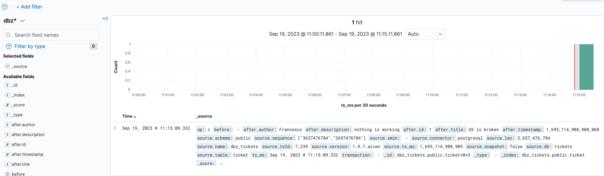
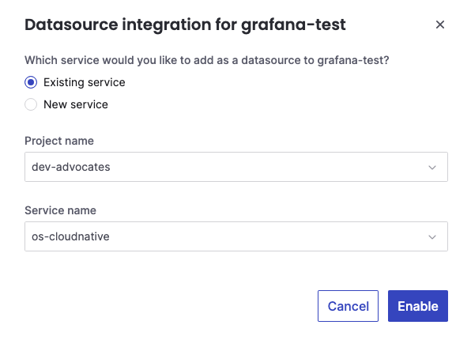
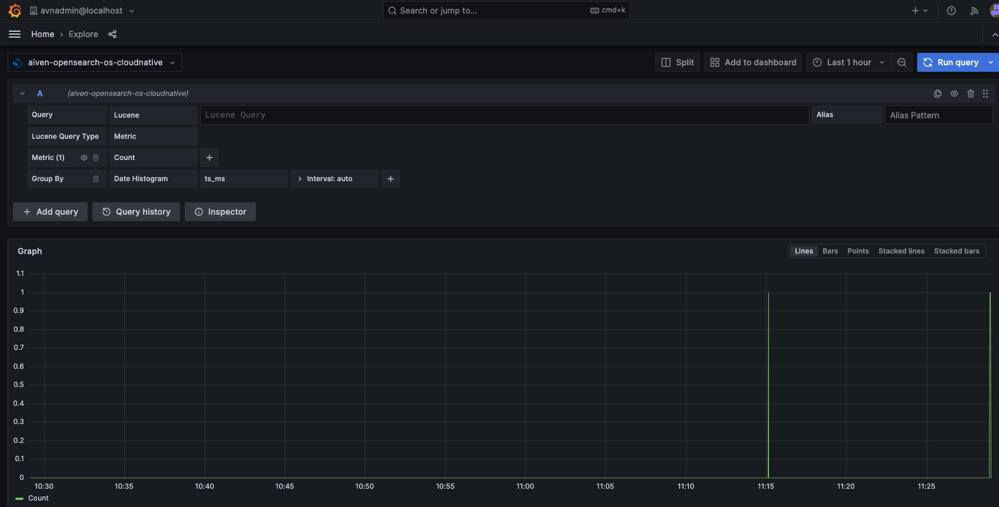

# ticket-manager

## prerequisites

### Aiven Operator

The Aiven Kuberrnetes Operator needs to be installed, please follow [these instructions](https://aiven.github.io/aiven-operator/installation/prerequisites.html)

### Setting the correct `project` for the CRs

The Aiven's CRs have the project `dev-advocates` hardcoded, make sure you set it to the correct Aiven `project`

## Applying the CRs

### Application and DB

Start by deploying the app and the PostgreSQL provisionning : 

```bash
kubectl apply -f manifests/app
```

Wait for the `pg-cloudnative` service to be in the state `RUNNING` on the Aiven platform you continue. Also make sure that the db `tickets` has been created

### Kafka, OpenSearch and integration services

Next you can install the rest of the services : 

```bash
kubectl apply -f manifests/integration
```

Give it some time before everything got reconcialited.

## Accessing the app

A service `ticket-manager` of type `LoadBalancer` has been created for you. 

```bash
curl -X 'POST' \
  'http://your_host/tickets' \
  -H 'accept: */*' \
  -H 'Content-Type: application/json' \
  -d '{
  "title": "My Ticket",
  "description": "My description",
  "author": "Sebi",
  "timestamp": "2022-03-10"
}'
```

## Discovering data in OpenSearch Dashboards

You can analyse the data in OpenSearch using OpenSearch Dashboards.

Once the set of services is in `RUNNING` mode, you should be able to access OpenSearch Dashboards. 

To access OpenSearch Dashboards:

* Navigate to the [Aiven Console](https://console.aiven.io/)
* Click on the **os-cloudnative** OpenSearch service
* Navigate to the **OpenSearch Dashboards** tab
* Click on the Service URI and login with the `avnadmin` user and the password show in the console

Once Logged in you need to create an **index pattern** to be able to analyze the data by:
* Clicking on the hamburger menu on the top left
* Clicking on **Stack Management** (at the bottom left)
* Click on **Index Patterns**
* Click on **Create Index Pattern**
* Define the index pattern name as `dbz` which will include the index `dbz_tickets.public.ticket` created by the Apache Kafka® Connect sink connector
* Select the `ts_ms` time field
* Click on **Create Index Pattern**

After creating the index pattern, you can now navigate to the **Discover** section and analyze your data by selecting the `dbz*` index pattern.



## Creating a Grafana Dashboard querying OpenSearch

You can analyse the data in OpenSearch using Grafana to create long term analytics.

### Create an Aiven for Grafana service

The first step is to create an Aiven for Grafana service by:

* Navigate to the [Aiven Console](https://console.aiven.io/)
* Click on the **Create Service**
* Select Grafana as a service type, the cloud vendor and region, the plan size and provide a service name
* Click on **Create Service** to start the service creation

### Create a datasource integration

The next step is to create an integration between OpenSearch and Grafana. From the [Aiven Console](https://console.aiven.io/):

* Navigate to the Aiven for Grafana service created
* Click on the **Integrations** tab
* Select the **Receive Data** integration
* Select the **os-cloudnative** service as Service name



* Click on **Enable**

### Customize the datasource integration

After creating the integration, is time to customize it in Grafana. Wait for the Aiven for Grafana service to be in `RUNNING` mode and then:

* Click on the **Service URI** show in the Aiven for Grafana service Overview tab
* Login with the `avnadmin` user and the password shown in the Aiven Console
* Click on the hamburger menu on the top left
* Select **Connections**, and **Your Connections**
* A connection `aiven-opensearch-os-cloudnative` should be listed, click on it
* In the OpenSearch details:
  * Write `dbz_tickets.public.ticket` as **Index name** 
  * Write `ts_ms` as Time field name
  * Click on the **Get Version and Save** button to retrieve the OpenSearch version
* Scroll to the bottom and click on **Save & test**

### Create a dataviz on top of the OpenSearch index

Finally, you can create a Grafana visualization on top of the OpenSearch index:

* Click on the hamburger menu on the top left
* Select **Explore**
* Select **aiven-opensearch-os-cloudnative** as source
* Customise the query details




